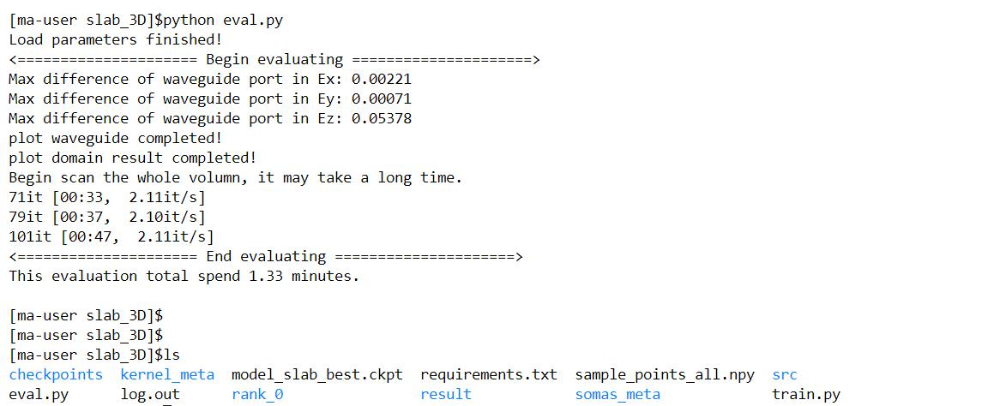
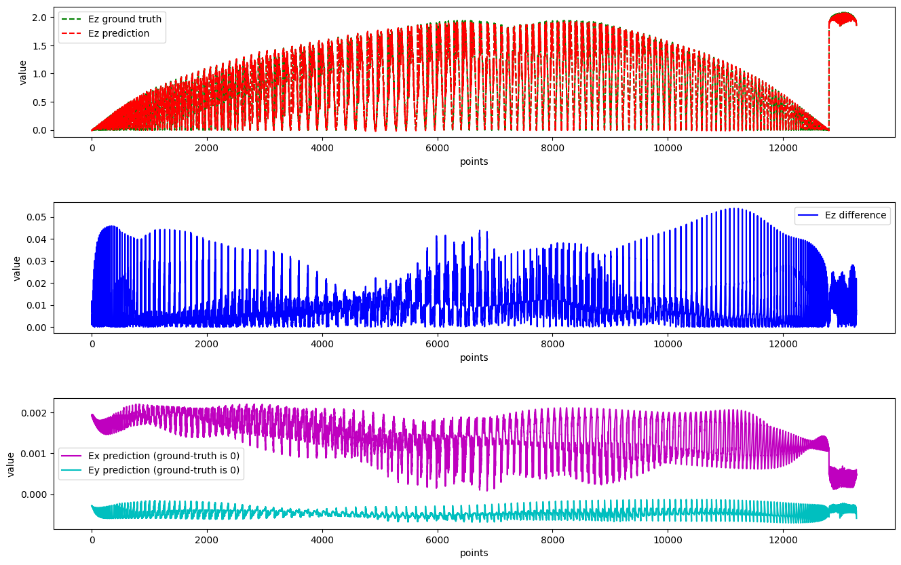
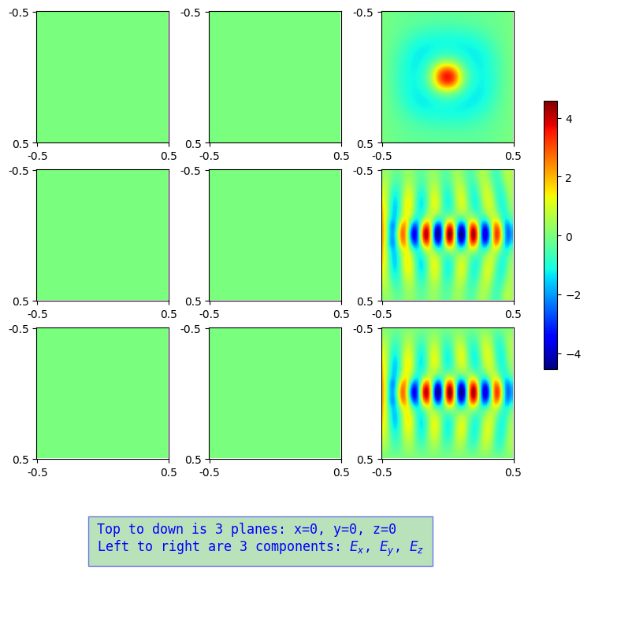

# 目录

# 模型名称

> PINN(Physical Informed Neural Network) 求解频域 3D Maxwell 方程：
> $$
> \nabla\times\nabla\times {E} + \epsilon_r k^2 {E} = {0}
> $$
> 在立方体内部无源，因此有 
> $$
> \nabla \cdot {E} = 0
> $$
> 则可以化简得出
> $$
> \nabla^2 {E} + \epsilon_r k^2 {E} = {0}
> $$
> 
> 仿真环境如图1所示：
> 
> 
> 
> - 仿真的立方体长、宽、高尺寸均为 $1$，取立方体中心为坐标原点，向右、向上、向外分别为 $x,y,z$ 方向。实心导体贯穿立方体且位于立方体中心，其截面尺寸为 $0.2\times 0.2$。
> - 四个环面（上、前、下、右）边界为 PEC（理想导体边界条件），右面为 ABC（吸收边界条件）。
> - PEC 边界条件方程为：
> $$
> {n}\times(\nabla\times{E})=0
> $$
> - ABC(Absorbing boundary condition，吸收边界条件)的边界方程为
> $$
> {n}\times{E}=0 \\
> \frac{\partial E_n}{\partial n} = 0
> $$

## 模型架构
> PDE方程求解的原理如下图所示：
> 
> 

> 采用 `mindelec.architecture` 提供的 `MultiScaleFCCell` 模型。采用多通道残差网络结合Sin激活函数的网络架构，其结构如图所示：
> 
> 

## 数据集

> 数据集包含3类：
> - 对立方体内部，使用 `mindelec` 定义的 `Cuboid` 采样，默认采用均匀网格划分，划分粒度为 $64\times 64 \times 64$ 。
> - 对立方体的4个PEC面和ABC面，使用 `mindelec` 定义的随机采样，采样点数默认为 `65536`。
> - 对波导管数据，采用外部数据，该数据为[nvidia modulus]() 进行该仿真时采用的数据，详见 `data/sample_points_all.npy` 文件，包含11000多条数据。


## 环境要求

> requirements.txt
> ```
> numpy
> matplotlib
> pandas
> tqdm
> easydict
> mindspore >= 1.5.0
> mindelec==0.1.0
> ```

## 快速入门

> 项目仅支持 Ascend平台。
> * 训练命令
> ```bash
> python train.py
> ```
> 说明：由于默认将日志打印到控制台，如果要保存成文本，可以使用 Linux 的管道及 `tee` 命令同时将输出保存到文件，例如保存到 `log.out`，则运行
> ```bash
> python train.py | tee log.out
> ```
> 
> - 推理命令
> ```bash
> python eval.py
> ```

## 脚本说明

### 脚本和样例代码

> ```python3
>    3D_dielectric_slab/
>    |   eval.py                    # 评估模型脚本
>    |   README.md                  # 项目介绍
>    |   requirements.txt           # 所需Python库
>    |   train.py                   # 训练脚本
>    |
>    +---data/
>    |       sample_points_all.npy  # 波导管数据
>    |
>    +---images/                    # README.md 中一些插图
>    |
>    \---src/                  
>            callback.py            # 回调函数
>            config.py              # 模型参数配置
>            dataset.py             # 生成数据集
>            maxwell.py             # Maxwell方程定义
> ```

### 脚本参数

> ```python
> # 在立方体中采样配置
> cuboid_sampling_config = ed({
>     'domain': ed({                   # 区域内采样
>         'random_sampling': False,    # 是否随机采样
>         'size': [64, 64, 64],        # 采样网格
>     }),
>     'BC': ed({                       # 边界点采样
>        'random_sampling': True,     # 是否随机采样
>         'size': 65536,               # 采样点数
>         'sampler': 'uniform',        # 均匀分布采样
>     })
> })
> 
> # 模型等config
> maxwell_3d_config = ed({
>     "name": "Maxwell3D",             # 模型名称
>     "geom_name": "cuboid",           # 几何体名称
>     "waveguide_name": "waveguide",   # 波导管名称
>     "waveguide_points_path": "data/sample_points_all.npy", # 波导管数据
>     
>     # 训练参数
>     "epochs": 3000,                  # 迭代epoch次数，建议 >=1000
>     "batch_size": 256,               # 训练batch_size
>     "lr": 0.001,                     # 训练学习率
>     "pretrained": False,             # 是否使用预训练模型，模型从 param_path加载。
>     "param_path": "checkpoints/model_slab_best.ckpt",  # 训练好的参数路径
>     
>    # 仿真环境参数
>     "coord_min": [-0.5, -0.5, -0.5], # xyz最小坐标值
>     "coord_max": [0.5, 0.5, 0.5],    # xyz最大坐标值
>     "slab_len": 0.2,                 # 中间电导体尺寸
>     "eps1": 1.5,                     # 电导体电导率
>     "eps0": 1.0,                     # 真空电导率
>     "wave_number": 32.0,             # 波数
>     
>     # 神经网络参数
>     "in_channel": 3,                 # 输入通道数
>     "out_channel": 3,                # 输出通道数
>     "layers": 6,                     # 重复次数
>     "neurons": 32,                   # 每层的神经元数量
>     
>     # 评估参数，其中训练好权重路径和训练参数param_path共用
>     "axis_size": 101,                # 评估时网格划分密度
>     "result_save_dir": "result",     # 评估结果保存文件夹
> })
> ```

## 训练过程

### 训练

> 训练命令
```shell
python train.py | tee log.out
```

> 训练过程日志

```log
# grep log.out
epoch: 1 step: 1024, loss is 7.13861083984375
epoch time: 368.796 s, per step time: 360.153 ms
Current epoch: 1, loss: 7.13861083984375, saved checkpoint.
...
epoch: 2995 step: 1024, loss is 0.08456216752529144
epoch time: 18.103 s, per step time: 17.679 ms
...
epoch: 2999 step: 1024, loss is 0.2671869993209839
epoch time: 18.077 s, per step time: 17.653 ms
epoch: 3000 step: 1024, loss is 0.18585500121116638
epoch time: 18.102 s, per step time: 17.678 ms
```

> 提供训练结果日志
> 例如：训练checkpoint将被保存在`checkpoints/`目录下，在回调函数中定义只有该epoch比上一个epoch的损失更小，则保存本epoch结束时的模型，否则不保存模型。


## 推理

### 推理过程

> 推理脚本

```bash
python eval.py
```

### 推理结果
> - 波导管输入面结果（最大差值 $E_z = 0.05378$, 其中最大值为 $2.082099191$,而在 $E_x, E_y$ 方向的差值均很小，分别为 $0.00221, 0.00071$）。验证截图如下：
> 
> 
>
> - 其中图中横坐标是各个点，纵坐标是值，例如第图最上面为 $E_z$ 的预测值和真实值。共有 13277 个点，真实值为绿色线连接，预测值为红色线，可以看出两者几乎一致。最下面的图（蓝色曲线）给出了真实值和预测值的差值。
> - $E_x, E_y$ 的真实值均为0，因此只给出预测值，预测值也接近0. 
> 
> 真实值由$(y,z)$ 坐标给出，难以绘制二维图。因此仅给出预测值结果，如下图：
> 
> 
>
> - 波导管在 $x=-0.5$ 截面，该面上只有 $E_z$ 分量的电场，场强由前述训练数据给出。下图绘制出三个中心面，即 $x=0, y=0, z=0$ 三个面上的场强分布。
> 
> 
> 
> - 从图中可以看出，$E_x, E_y$ 几乎为总 $0$。
> - 由于中间的介质电导率为 $1.5$，而周围的为 $1.0$，可以看到电磁波主要在中间的电介质中传播。


## 性能

### 训练性能

提供您训练性能的详细描述.

| Parameters                 | Ascend 910                                                   |
| -------------------------- | ------------------------------------------------------------ | 
| Model Version              | PINN Cavity                                               |  
| Resource                   | Ascend: 1*Ascend 910, CPU: 24vCPUs 96GB | 
| uploaded Date              | 09/30/2022 (month/day/year)                                  | 
| MindSpore Version          | 1.15.1                                                        | 
| Dataset                    | 立方体内部、边界采样；外部波导管数据                           | 
| Training Parameters        | epoch=3000, steps per epoch=1024, batch_size =256              | 
| Optimizer                  | Adam                                                     | 
| Loss Function              | L2范数                                      | 
| outputs                    | 电场分量 $E_x$, $E_y$, $E_z$                               | 
| Loss                       | 0.0029008                                                | 
| Speed                      | 16.8 s/epoch（第一个epoch耗时较长，约368秒）      | 
| Total time                 | 14 hours                                     | 
| Parameters (KB)            | 220 KB                                                         | 
| Scripts                    | [link](https://git.openi.org.cn/forcekeng/PINN_Maxwell3D)   |

### 推理性能

| Parameters          | Ascend                      |
| ------------------- | --------------------------- |
| Resource            | Ascend: 1*Ascend 910, CPU: 24vCPUs 96GB    |
| Uploaded Date       | 9/30/2022 (month/day/year) |
| MindSpore Version   | 1.15.1                       |
| Dataset             | 自定义数据集                 |
| outputs             | 电场分量 $E_x$, $E_y$, $E_z$                |
| Model for inference | 220KB (.ckpt)             |
| Total time                 | 1.36 Minutes                | 

## 参考资料
[Nvidia Modulus](https://docs.nvidia.com/deeplearning/modulus/text/intermediate/em.html#)


## 贡献指南

如果你想参与贡献昇思的工作当中，请阅读[昇思贡献指南](https://gitee.com/mindspore/models/blob/master/CONTRIBUTING_CN.md)和[how_to_contribute](https://gitee.com/mindspore/models/tree/master/how_to_contribute)

### 贡献者

此部分根据自己的情况进行更改，填写自己的院校和邮箱

* [耿力](https://git.openi.org.cn/forcekeng) (同济大学)

## ModelZoo 主页

请浏览官方[主页](https://gitee.com/mindspore/models)。
